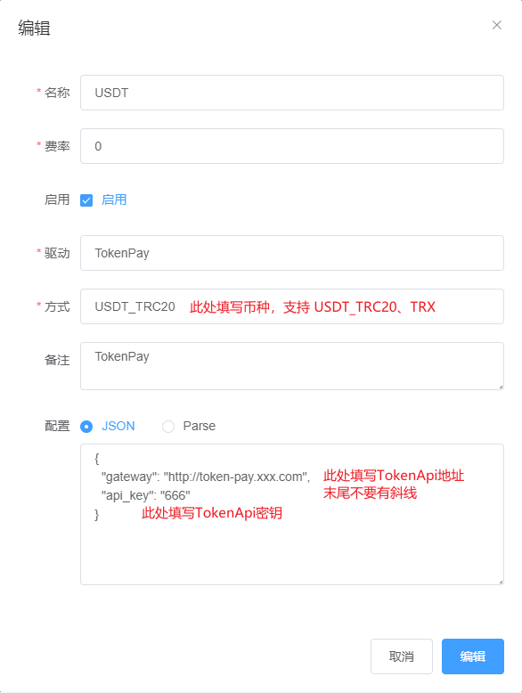

## `card-system`对接`TokenPay`

### 1. 将插件复制到`card-system`对应目录
### 2. 到`card-system`后台-**管理中心**-**支付渠道**-**子渠道**中添加支付方式
注意事项
1. API地址末尾请不要有斜线，如`https://token-pay.xxx.com`  
2. 方式字段请填写币种，支持的币种请参考[币种说明](../../Wiki/Currency.md) 
3. 如果你要同时支持USDT和TRX付款，你需要添加两条子渠道，依此类推
4. 在**前台支付**中添加一个支付方式，子渠道中选中刚刚添加的子渠道
5. 如果你要同时支持USDT和TRX付款，你需要添加两条前台支付方式，并分别选中对应的子渠道

请参考此图填写
