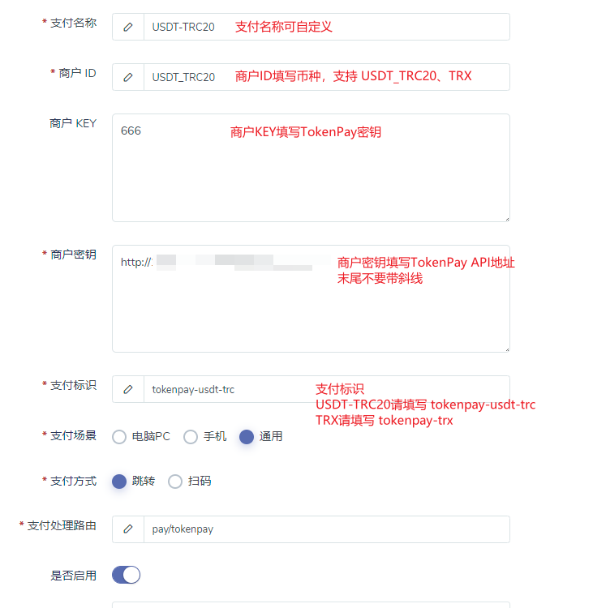

## `dujiaoka`对接`TokenPay`

### 1. 将插件复制到`dujiaoka`对应目录
### 2. 将`database`内的`add.sql`内的sql语句，复制到你的mysql执行（也可以跳过这一步手动添加）
### 3. 到`dujiaoka`后台-**配置**-**支付配置**中`添加/编辑`支付方式
注意事项
1. API地址末尾请不要有斜线，如`https://token-pay.xxx.com`  
2. 商户KEY字段请填写币种，支持的币种请参考[币种说明](../../Wiki/Currency.md) 
3. 如果你要同时支持USDT和TRX付款，你需要添加两条支付方式，依此类推 (已经执行了`add.sql`的会自动给你添加支持的所有支付方式，直接修改即可)  
4. 扫码版本请将`支付路由`填写为`pay/tokenpay-qr`

请参考此图填写
