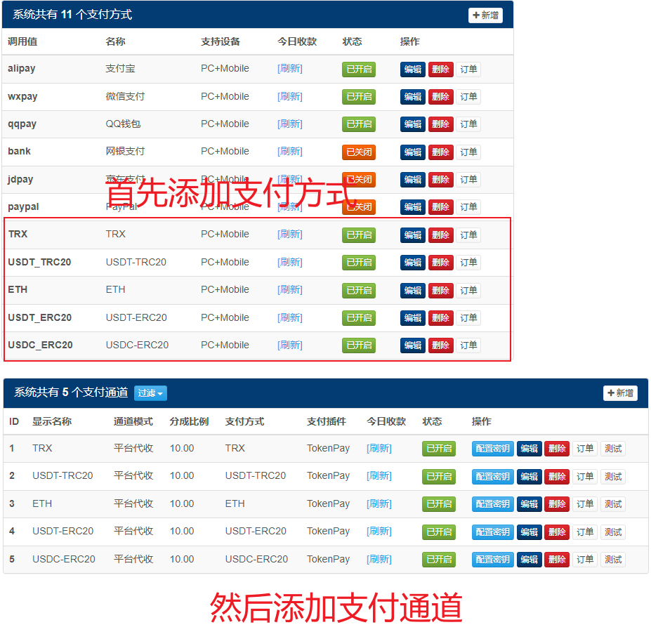

## `epay-pro(彩虹易支付)`对接`TokenPay`
### 1. 将插件复制到`epay-pro`对应目录
### 3. 到`epay-pro`后台-**应用管理**-**本地插件**-**刷新本地插件列表**，插件列表显示`TokenPay`插件即可
### 4. 添加支付方式（推荐使用方法二，简单快捷）
> 方法一：到`epay-pro`后台-**支付接口**-**支付方式**中添加支付方式，每个币种添加一个支付方式。 

> 方法二：直接到`epay-pro`数据库里执行目录下的[增加支付方式.sql](../epay/增加支付方式.sql)

### 5. 到`epay-pro`后台-**支付接口**-**支付通道**中添加支付通道，每个币种添加一个通道
注意事项
1. API地址末尾请不要有斜线，如`https://token-pay.xxx.com`  
2. API Token和你的TokenPay配置文件保持一致
3. 签名算法根据TokenPay的`UseHmacSha256`字段，为false则使用md5，为true则选择HmacSha256

请参考此图填写

