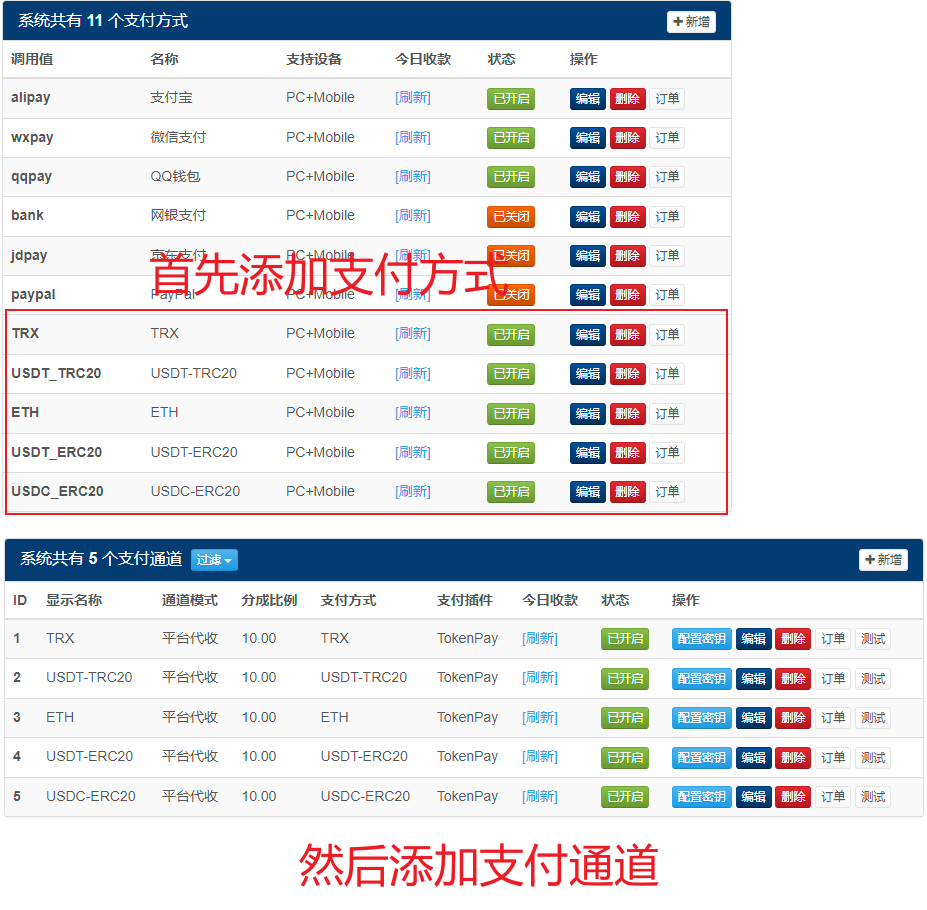

## `epay(彩虹易支付)`对接`TokenPay`

### 1. 将插件复制到`epay`对应目录，然后到epay数据库里执行目录下的[增加字段长度.sql](增加字段长度.sql)
### 2. 到`epay`后台-**支付接口**-**支付插件**-**刷新插件列表**，插件列表显示`TokenPay`插件即可
### 3. 到`epay`后台-**支付接口**-**支付方式**中添加支付方式，每个币种添加一个支付方式。（也可直接到epay数据库里执行目录下的[增加支付方式.sql](增加支付方式.sql)）
### 4. 到`epay`后台-**支付接口**-**支付通道**中添加支付通道，每个币种添加一个通道
注意事项
1. API地址末尾请不要有斜线，如`https://token-pay.xxx.com`  
2. 方式字段请填写币种，支持的币种请参考[币种说明](../../Wiki/Currency.md) 
3. 如果你要同时支持USDT和TRX付款，你需要添加两条支付方式和两条支付通道，依此类推

请参考此图填写
