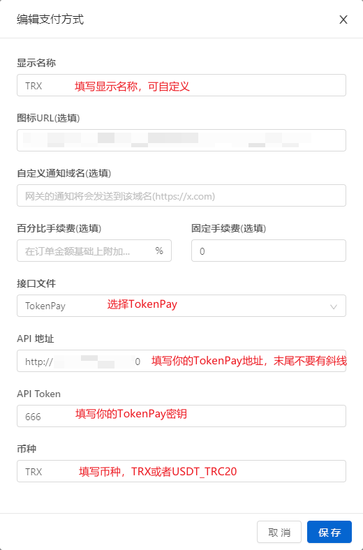

## `v2board`对接`TokenPay`

### 1. 将插件复制到`v2board`对应目录
### 2. 到`v2board`后台-**支付配置**中添加支付方式
注意事项
1. API地址末尾请不要有斜线，如`https://token-pay.xxx.com`  
2. 币种请填写指定字符 `USDT_TRC20`、`TRX`、`ETH`、`USDT_ERC20`、`USDC_ERC20`  
3. 如果你要同时支持USDT和TRX付款，你需要添加两条支付方式，依此类推  

请参考此图填写
