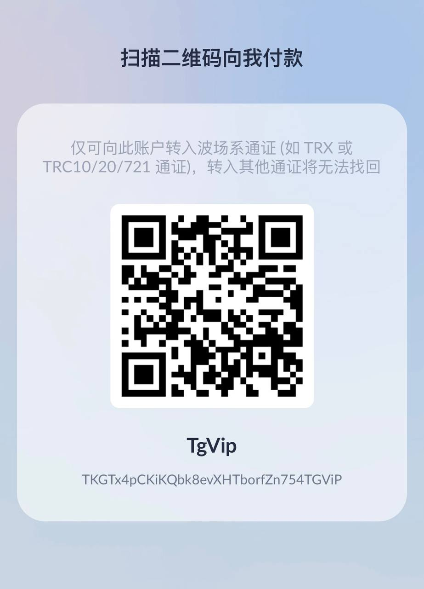

# TokenPay
<p>
<a href="https://www.gnu.org/licenses/gpl-3.0.html"></a>
<a href="https://dotnet.microsoft.com/zh-cn/download/dotnet/8.0"></a>
<a href="https://github.com/assimon/dujiaoka/releases/tag/1.0.0"></a>
</p>
<h2 align="center">简体中文 | <a href="README_EN.md">English</a></h2>  

## TokenPay - `区块链`支付解决方案

>一款开源的，支持以动态收款地址或静态收款地址收取波场的`TRX`、`USDT-TRC20`以及`ETH系原生币`以及`ETH系ERC20代币`的支付解决方案！ 理论上支持`所有ETH系的区块链`，常见的ETH系的区块链有：`以太坊(ETH)`、`币安智能链(BSC)`、`Polygon`等等。
 

## AD -- 机器人推广
查币机 - 链上信息查询：[查币机](https://t.me/QueryCoinBot)
> 支持TRON、ETH、Polygon、BSC多链资产查询，也支持多种法币与区块链货币的实时汇率查询。

USDT、TRX交易监控机器人：[USDT、TRX交易监控](https://t.me/CoinListenBot)
> 监控波场地址余额变化，速度比钱包App的推送更快！！！

兑币机 - TRX自动兑换：[兑币机](https://t.me/CoinConvertBot)
> 自用兑币机，并不是开源版机器人！！！

波场能量机器人：[波场能量机器人](https://t.me/Buy_Energy_Bot)
> 波场能量租用，有能量时转账USDT不扣TRX，为你节省50-70%的TRX

TG会员秒开机器人：[TG会员秒开-全自动发货](https://t.me/BuyYourPremiumBot)
> 24小时自动开通Telegram Premium会员，只需一个用户名即可开通。

+888匿名号码租用机器人：[+888匿名号码租用机器人](https://t.me/Zu888Bot)
> Telegram +888 匿名号码租用机器人。

客服爸爸机器人：[客服爸爸](https://t.me/KeFuFatherBot)
> 免费创建您自己的客服机器人（双向机器人）。


## 项目简介
- `TokenPay`是一个由`C#语言`编写的私有化部署的`区块链`支付解决方案。
- 页面支持以`简体中文`、`英语`、`俄语`显示，依据访问者设备语言自适应，不支持的语言默认显示`英语`
- 本项目不依赖任何外部资源，无需另外部署`数据库`，采用轻量化的`sqlite`，也无需`redis`。
- 任意项目都可以对接，轻松实现`TRX`、`USDT-TRC20`以及`ETH系原生币`以及`ETH系ERC20代币`，理论支持`所有ETH系的区块链`收款！😊 😊 😊
- `TokenPay` 遵守 [GPLv3](https://www.gnu.org/licenses/gpl-3.0.html) 开源协议!

## 项目特点
- `C#语言`跨平台实现，支持x86和arm芯片架构的win/linux/mac设备😁
- 支持每单一个收款地址，或每个用户一个收款地址，解决了单一地址收款，容易导致错误完成订单的痛点。
- 无需额外环境配置，仅运行一个编译后二进制文件即可使用

## 项目结构
```
TokenPay
    ├── Plugs ---> (插件)
    ├── Wiki ---> (知识库）
    └── src ---> (项目核心目录)
```
## 现有插件
- [独角数卡插件](Plugs/dujiaoka/) | [独角数卡](https://github.com/assimon/dujiaoka) 
- [v2board插件](Plugs/v2board/) | [v2board](https://github.com/v2board/v2board) 
- [card-system插件](Plugs/card-system/) | [card-system](https://github.com/Tai7sy/card-system) 
- [彩虹易支付插件](Plugs/epay/) | [彩虹易支付官网](https://pay.cccyun.cc)
- [用户贡献的WHMCS插件](https://doc.whmcscn.com/web/#/5/30)，感谢 [@ninetian](https://github.com/ninetian) [#13](https://github.com/LightCountry/TokenPay/issues/13)，使用者自行检查代码安全情况 | [WHMCS官网](https://www.whmcs.com/)

## 系统对接
- `TokenPay`接口文档👉🏻[TokenPay接口文档](Wiki/docs.md)
- **也可参考仓库内现有插件**

## 教程：
- 宝塔运行`TokenPay`教程👉🏻[宝塔运行TokenPay](Wiki/BT_RUN.md)
- 手动运行`TokenPay`教程👉🏻[手动运行TokenPay](Wiki/manual_RUN.md)
- 小白也可查看用户贡献的搭建视频：[TokenPay详细搭建教程 对接易支付和独角数卡](https://www.youtube.com/watch?v=w75mTOAnLDw)


## 加入交流/意见反馈
- `TokenPay`频道[https://t.me/TokenPayChannel](https://t.me/TokenPayChannel)
- `TokenPay`交流群组[https://t.me/TokenPayGroup](https://t.me/TokenPayGroup)

## 设计实现
`TokenPay`的实现方式与其他项目原理类似，都是通过`TronGrid`、`EtherScan`等提供的api，      
轮询订单未过期的钱包地址的`TRX`、`ETH`、`USDT`、`USDC`等入账事件，将入账金额，与数据库的订单金额进行对比，若一致，则视为订单完成
```
简单的原理：
0.服务器定时同步交易所最新汇率
1.客户支付，交易上链
2.服务器定时通过API轮询，获取监听地址下的最新入账交易数据，并与数据库订单对比
3.若金额一致，将订单标记为完成
4.订单完成后，异步通知任务将订单完成事件回调给平台
```

## 打赏
如果该项目对您有所帮助，希望可以请我喝一杯咖啡☕️
```
USDT-TRC20打赏地址: TKGTx4pCKiKQbk8evXHTborfZn754TGViP
```


## 致谢
感谢以下开源项目：

[Serilog](https://github.com/serilog/serilog) 

[FreeSql](https://github.com/dotnetcore/FreeSql) 

[Flurl](https://github.com/tmenier/Flurl) 

[Nethereum](https://github.com/Nethereum/Nethereum) 

[HDWallet](https://github.com/farukterzioglu/HDWallet) 

## 声明
`TokenPay`为开源的产品，仅用于学习交流使用！       
不可用于任何违反中华人民共和国(含台湾省)或使用者所在地区法律法规的用途。           
因为作者即本人仅完成代码的开发和开源活动(开源即任何人都可以下载使用或修改分发)，从未参与用户的任何运营和盈利活动。       
且不知晓用户后续将程序源代码用于何种用途，故用户使用过程中所带来的任何法律责任即由用户自己承担。            
```
！！！Warning！！！
项目中所涉及区块链代币均为学习用途，作者并不赞成区块链所繁衍出代币的金融属性
亦不鼓励和支持任何"挖矿"，"炒币"，"虚拟币ICO"等非法行为
虚拟币市场行为不受监管要求和控制，投资交易需谨慎，仅供学习区块链知识
```
[](https://starchart.cc/LightCountry/TokenPay)
