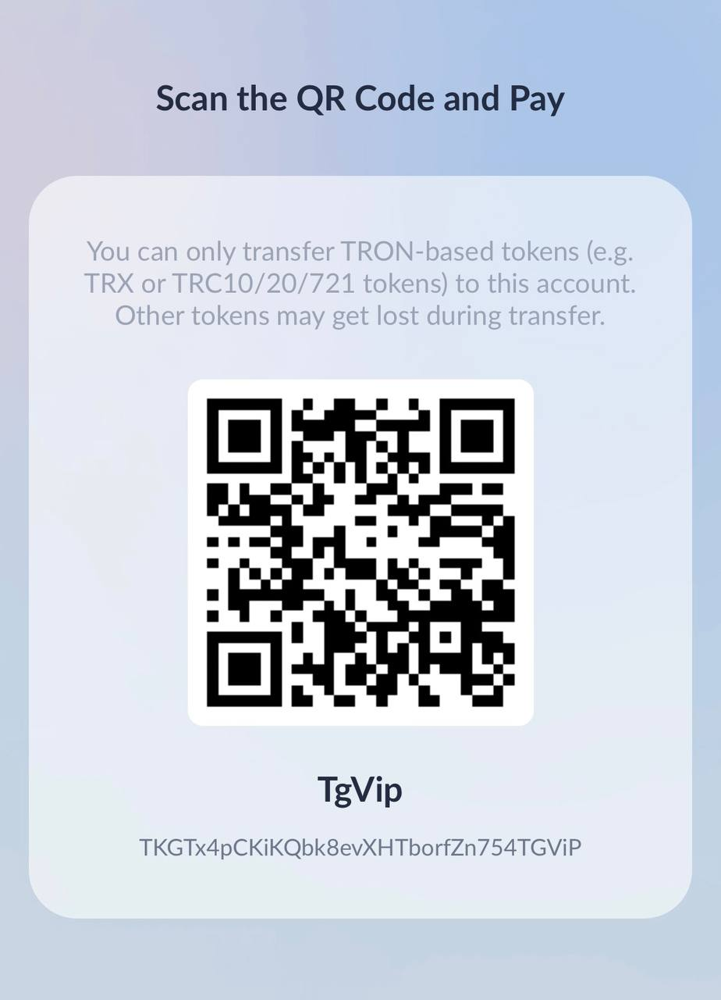

# TokenPay
<p>
<a href="https://www.gnu.org/licenses/gpl-3.0.html"></a>
<a href="https://dotnet.microsoft.com/en-us/download/dotnet/8.0"></a>
<a href="https://github.com/assimon/dujiaoka/releases/tag/1.0.0"></a>
</p>
<h2 align="center"><a href="README.md">简体中文</a> | English</h2>  

## TokenPay - `Blockchain` Payment Solution

>An open source payment solution that supports receiving `TRX`, `USDT-TRC20` and `ETH native coins` as well as `ETH ERC20 tokens` with dynamic or static payout addresses! Theoretically supports `all ETH-system blockchains`, common ETH-system blockchains are: `Ether (ETH)`, `Binance Smart Chain (BSC)`, `Polygon`, etc.


## Project Description
- `TokenPay` is a privately deployed `blockchain` payment solution written in `C# language`.     
- The project does not depend on any external resources, no need to deploy a separate `database`, uses lightweight `sqlite`, and does not require `redis`.
- Any project can be docked to easily implement `TRX`, `USDT-TRC20` and `ETH-system native coins` as well as `ETH-system ERC20 tokens`, theoretically supporting `all ETH-system blockchain` collections! 😊 😊 😊 😊
- `TokenPay` is licensed under the terms of the [GPLv3](https://www.gnu.org/licenses/gpl-3.0.html) license.

## Project Features
- `C# language` cross-platform implementation, support x86 and arm chip architecture win/linux/mac devices😁
- Support one collection address per order, or one collection address per user, solving the pain point of single address collection, which easily leads to wrong order completion.
- No additional environment configuration, just run a compiled binary file to use

## Project Structure
```
TokenPay
    ├── Plugs ---> (Plug-in)
    ├── Wiki ---> (Wiki）
    └── src ---> (Core)
```
## Available plug-ins
- [dujiaoka](Plugs/dujiaoka/) | [dujiaoka](https://github.com/assimon/dujiaoka) 
- [v2board](Plugs/v2board/) | [v2board](https://github.com/v2board/v2board) 
- [card-system](Plugs/card-system/) | [card-system](https://github.com/Tai7sy/card-system) 
- [epay](Plugs/epay/) | [epay](https://pay.cccyun.cc)

## System Api(Only Chinese)
- `TokenPay`Api Docs👉🏻[TokenPay Api Docs](Wiki/docs.md)
- **Also refer to the existing plugins in the repository**

## Tutorials(Only Chinese)：
- Run `TokenPay` Tutorial with aaPanel 👉🏻[aaPanel Tutorial](Wiki/BT_RUN.md)
- Run `TokenPay` tutorial manually👉🏻[Manually Tutorial](Wiki/manual_RUN.md)


## Join the exchange / feedback
- `TokenPay`Channel[https://t.me/TokenPayChannel](https://t.me/TokenPayChannel)
- `TokenPay`Chat[https://t.me/TokenPayGroup](https://t.me/TokenPayGroup)

## Design Implementation
The implementation of `TokenPay` is similar to the principle of other projects, it is through the api provided by `TronGrid`, `EtherScan`, etc.      
Poll the `TRX`, `ETH`, `USDT`, `USDC` entry events of the unexpired wallet address of the order, compare the entry amount with the order amount in the database, and if it is the same, the order is considered completed.
```
Simple principle.
0. The server synchronizes the latest exchange rate of the exchange at regular intervals
1. Customers make payments and transactions are uploaded to the chain
2. The server regularly polls through the API to get the latest recorded transaction data under the listening address, and compares it with the database orders
3. If the amount is the same, the order will be marked as completed
4. After the order is completed, the asynchronous notification task will call back the order completion event to the platform
```

## Donate
If this project has helped you, I hope you can buy me a cup of coffee☕️
```
USDT-TRC20: TKGTx4pCKiKQbk8evXHTborfZn754TGViP
```


## Thanks
Thanks to the following open source projects.

[Serilog](https://github.com/serilog/serilog) 

[FreeSql](https://github.com/dotnetcore/FreeSql) 

[Flurl](https://github.com/tmenier/Flurl) 

[Nethereum](https://github.com/Nethereum/Nethereum) 

[HDWallet](https://github.com/farukterzioglu/HDWallet) 

## Disclaimers
`TokenPay` is an open source product and is intended for learning and communication purposes only!       
It cannot be used for any purpose that violates the laws and regulations of the People's Republic of China (including Taiwan Province) or the user's region.           
Because the author, i.e. myself, only developed the code and open source activities (open source means that anyone can download and use it or modify it for distribution), and never participated in any operation or profit-making activities of the user.       
And we do not know what use the user will subsequently use the program source code for, so any legal responsibility brought about by the user's use is the user's own responsibility.            
```
！！！Warning！！！
The blockchain tokens involved in the project are for learning purposes, and the author does not endorse the financial attributes of the tokens derived from the blockchain.
We do not encourage and support any illegal behavior such as "mining", "speculation", "virtual coin ICO", etc.
Virtual coin market behavior is not subject to regulatory requirements and control, investment transactions need to be cautious, only for learning blockchain knowledge
```
[](https://starchart.cc/LightCountry/TokenPay)
