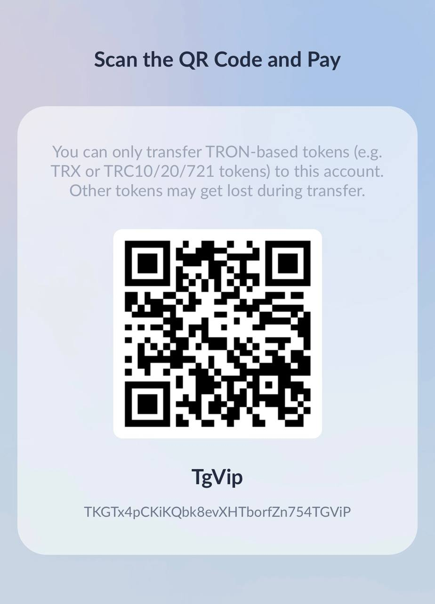

# TokenPay

<p>
<a href="https://www.gnu.org/licenses/gpl-3.0.html"></a>
<a href="https://dotnet.microsoft.com/en-us/download/dotnet/8.0"></a>
<a href="https://github.com/assimon/dujiaoka/releases/tag/1.0.0"></a>
</p>

<h2 align="center"><a href="README.md">简体中文</a> | English</h2>

## TokenPay — a blockchain payment solution

TokenPay is an open-source, self-hosted payment solution that accepts `TRX`, `USDT-TRC20`, EVM-native coins, and ERC-20 tokens through either dynamic or static receiving addresses. It can theoretically work with any EVM-compatible blockchain, including Ethereum, BNB Smart Chain, and Polygon.

## Overview

- TokenPay is written in C# and is designed for private, self-hosted deployments.
- Payment pages are available in Simplified Chinese, English, and Russian. The interface follows the visitor's device language and falls back to English when the language is unsupported.
- No separate database server or Redis instance is required. TokenPay uses an embedded SQLite database.
- It can be integrated with any system that needs to accept TRX, USDT-TRC20, EVM-native coins, or ERC-20 tokens.
- TokenPay is distributed under the [GPLv3 license](https://www.gnu.org/licenses/gpl-3.0.html).

## Features

- Cross-platform C# implementation for Windows, Linux, and macOS on x86 and ARM hardware.
- Supports assigning a receiving address per order or per customer, reducing the risk of matching a payment to the wrong order when a shared address is used.
- Runs as a compiled application without requiring a separate database or cache service.
- Includes an optional, read-only administration interface for reviewing orders, wallet balances, and exchange rates. Administrators can also reconcile an expired order after independently verifying its on-chain payment.

## Repository layout

```text
TokenPay
├── Plugs   # Integration plugins
├── Wiki    # Documentation
└── src     # TokenPay application source
```

## Available integrations

- [Dujiaoka plugin](Plugs/dujiaoka/) | [Dujiaoka](https://github.com/assimon/dujiaoka) 
- [v2board plugin](Plugs/v2board/) | [v2board](https://github.com/v2board/v2board) 
- [card-system plugin](Plugs/card-system/) | [card-system](https://github.com/Tai7sy/card-system) 
- [Epay plugin](Plugs/epay/) | [Epay website](https://pay.cccyun.cc)
- [Community-maintained WHMCS plugin](https://doc.whmcscn.com/web/#/5/30), contributed by [@ninetian](https://github.com/ninetian) in [issue #13](https://github.com/LightCountry/TokenPay/issues/13). Review community-contributed code before using it in production. | [WHMCS](https://www.whmcs.com/)

## Integration and documentation

- [TokenPay API documentation](Wiki/docs.md) (Chinese)
- [Administration interface guide](Wiki/admin.md) (Chinese)
- [Embedded views and runtime customization](Wiki/ViewCustomization.md) (Chinese)
- The plugins included in this repository also provide practical integration examples.

## Tutorials

- Releases include self-contained packages and smaller packages whose names contain `framework-dependent`. The latter require .NET 8 ASP.NET Core Runtime to be installed; see the [manual deployment guide](Wiki/manual_RUN.md) (Chinese) for details.
- [Run TokenPay with aaPanel](Wiki/BT_RUN.md) (Chinese)
- [Run TokenPay manually](Wiki/manual_RUN.md) (Chinese)
- [Run TokenPay with Docker](Wiki/Docker-RUN.md) (Chinese)
- [Detailed installation and Epay/Dujiaoka integration video](https://www.youtube.com/watch?v=w75mTOAnLDw) (Chinese)

## Administration interface

The administration interface is disabled by default and returns HTTP 404 under `/admin` until it is explicitly enabled. It provides paginated, searchable, read-only access to order, wallet, and exchange-rate records. Wallet private keys are neither selected from the database nor displayed.

Authentication uses a secure, hashed password and an HTTP-only session cookie. Login attempts are rate-limited, state-changing requests are protected against CSRF, and HTTPS-only cookies are enabled by default for production use.

To generate an administrator password hash:

```bash
dotnet TokenPay.dll --hash-admin-password "your-long-random-password"
```

Then configure the `Admin` section in `appsettings.json`:

```json
{
  "Admin": {
    "Enabled": true,
    "Username": "admin",
    "PasswordHash": "paste-the-generated-hash-here",
    "SessionMinutes": 30,
    "RequireHttps": true
  }
}
```

Keep `RequireHttps` enabled on public or production deployments. See the [administration guide](Wiki/admin.md) for configuration details, security recommendations, and the manual order reconciliation procedure.

## Community and feedback

- [TokenPay announcement channel](https://t.me/TokenPayChannel)
- [TokenPay discussion group](https://t.me/TokenPayGroup)

## How payment detection works

TokenPay uses APIs provided by services such as TronGrid and blockchain explorers to poll incoming TRX, ETH, USDT, USDC, and other supported transfers to addresses associated with active orders. It compares each incoming amount with the expected order amount and completes the order when a valid match is found.

```text
0. The server periodically refreshes exchange rates.
1. The customer submits a payment and the transaction is recorded on-chain.
2. The server polls blockchain APIs for recent incoming transactions to monitored addresses.
3. A matching transaction causes the order to be marked as paid.
4. The asynchronous notification service sends the payment result to the merchant's callback URL.
```

## Donate

If TokenPay has been useful to you, you can support its development:

```text
USDT-TRC20: TKGTx4pCKiKQbk8evXHTborfZn754TGViP
```



## Acknowledgements

TokenPay uses or has benefited from the following open-source projects:

[Serilog](https://github.com/serilog/serilog) 

[FreeSql](https://github.com/dotnetcore/FreeSql) 

[Flurl](https://github.com/tmenier/Flurl) 

[Nethereum](https://github.com/Nethereum/Nethereum) 

[HDWallet](https://github.com/farukterzioglu/HDWallet) 

## Disclaimer

TokenPay is open-source software intended for learning, research, and technical communication. It must not be used in violation of the laws or regulations of the People's Republic of China (including Taiwan Province) or the jurisdiction in which the user operates.

The author develops and publishes the source code only and does not participate in users' operations or commercial activities. Users are solely responsible for how they deploy and use the software and for any legal consequences arising from that use.

> **Warning**
>
> Blockchain tokens referenced by this project are included for educational purposes. The author does not endorse their financial or speculative attributes and does not encourage or support illegal activities involving mining, token speculation, or ICOs. Digital-asset markets can be volatile and may not be subject to conventional regulatory protections. Exercise caution and comply with all applicable laws.

[](https://starchart.cc/LightCountry/TokenPay)
